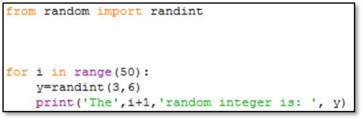

# Python Prorgamming For Y12
YEar12 Lessons for Python Programming

Solution Manual for

A Practical Introduction to
Python Programming
(Brian Heinold
Department of Mathematics and Computer Science
Mount St. Mary’s University)

A Practical Introduction to
Python Programming
(Brian Heinold
Department of Mathematics and Computer Science
Mount St. Mary’s University)

Solution Manual

Engr. Hassan Mehmood Khan

Chapter 3
Exercise Solutions

Question: 1

 
Question: 2
 
Question: 3
 
Question: 4
 

Question: 5
 
Question: 6
 
Question: 7
 
Question: 8
 

